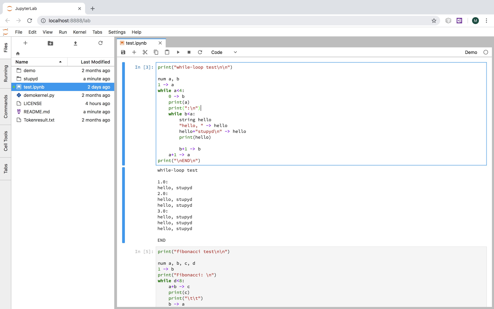

# demo-kernel
a demo jupyter kernel for stupyd programming language

## Installation

Step 1*(skip if you already have)*: intstall jupyter notebook

~~~
➜ pip install jupyter
~~~

Step 2: clone the repository and install stupyd kernel

~~~
➜ # clone the repository
➜ cd demo-kernel
➜ jupyter kernelspec install demo
~~~

## Test

You can then run the following to test and try it.

~~~
➜ cd demo-kernel
➜ jupyter notebook test.ipynb
~~~

You should see the following:

**Have fun with StuPyd!**

## More Information

You can get more information about StuPyd at:

1. [StuPyd Interpreter Repository](https://github.com/StuPyd/stupyd-lang)
2. [StuPyd Tutorial Page (it's not finished yet)](https://stupyd.github.io/tutorial/)
